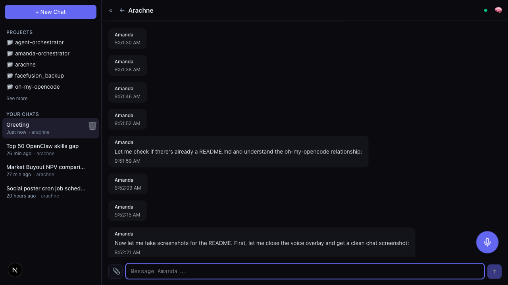
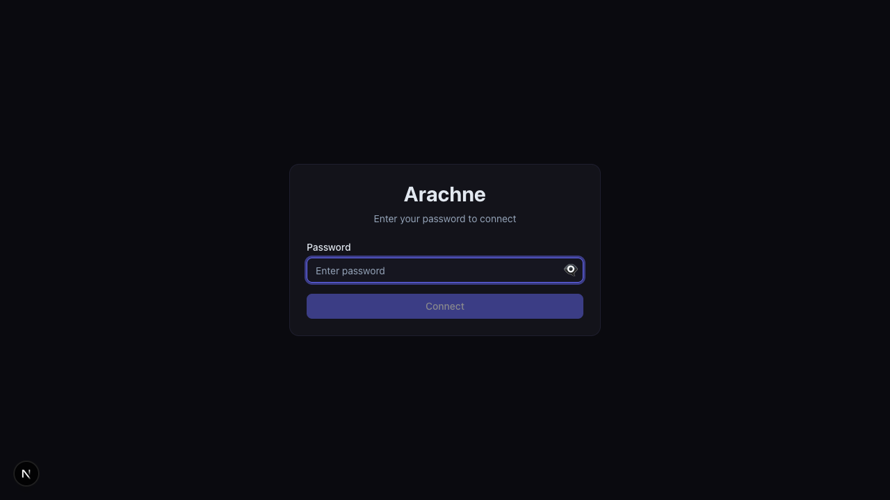
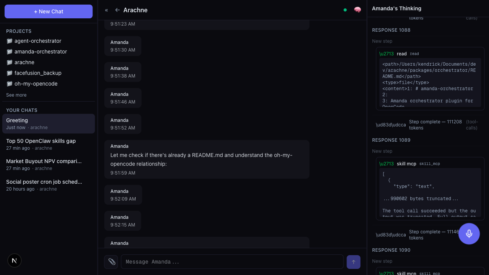
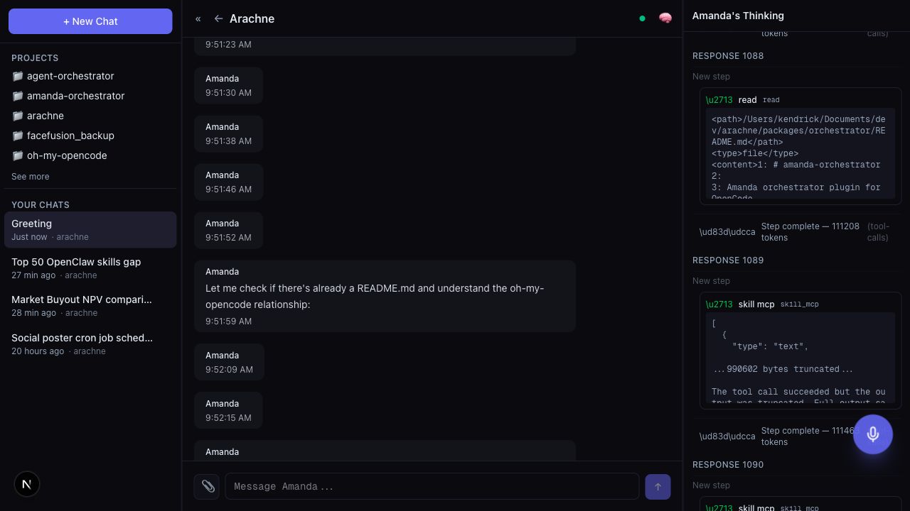

# Arachne

A web-based chat UI for [OpenCode](https://github.com/opencode-ai/opencode), built for the [oh-my-opencode](https://github.com/ohmyopencode) ecosystem.



## Features

- **Streaming chat** with real-time responses and markdown rendering
- **Session management** — create, switch, and delete conversations
- **Thinking panel** — watch reasoning, tool calls, and agent activity live
- **Voice mode** — full-duplex voice with VAD (Voice Activity Detection)
- **File upload** — attach images and documents via button or paste
- **Resizable panels** — drag to resize sidebar, chat, and thinking panel
- **Mobile responsive** — hamburger sidebar on small screens
- **Secure auth** — password-based with httpOnly cookies

## Quick Start

```bash
# 1. Clone and install
git clone <arachne-repo-url> arachne
cd arachne && bun install

# 2. Start OpenCode headless server (from your project directory)
export OPENCODE_SERVER_PASSWORD="your-password"
opencode serve --port 4096

# 3. Start Arachne dashboard (new terminal)
cd arachne/packages/dashboard
bun run dev
```

Open **http://localhost:3000** and log in with your password.

## Prerequisites

- [Bun](https://bun.sh) (`curl -fsSL https://bun.sh/install | bash`)
- [OpenCode CLI](https://github.com/opencode-ai/opencode) (`npm install -g @opencode-ai/cli`)

## Configuration

Create `packages/dashboard/.env.local`:

```bash
OPENCODE_API_URL=http://localhost:4096
OPENCODE_SERVER_PASSWORD=your-password-here
```

## Screenshots

| Login | Thinking Panel |
|-------|---------------|
|  |  |

| Voice Mode |
|------------|
|  |

## Architecture

```
Browser (localhost:3000)
    |  HTTP / SSE
Next.js Dashboard (port 3000)
    |  @opencode-ai/sdk
OpenCode Server (port 4096)  <-- runs in your project directory
    |
Orchestrator (port 8090)     <-- voice WebSocket (optional)
```

**Auth flow:** Password -> httpOnly cookie -> Basic Auth to OpenCode

**Message flow:** Browser -> `/api/sessions/{id}/prompt` -> SDK -> OpenCode Server -> SSE stream back

## Services

| Service | Port | Required |
|---------|------|----------|
| Dashboard | 3000 | Yes |
| OpenCode Server | 4096 | Yes |
| Voice Server | 8090 | No (orchestrator) |

## Monorepo Structure

```
packages/
  dashboard/      # Next.js chat UI (main package)
  orchestrator/   # Agent orchestrator (Amanda)
  shared/         # Shared types and utilities
  web/            # Web utilities
  skills/         # Custom agent skills
  ...
```

## Troubleshooting

| Problem | Fix |
|---------|-----|
| "Failed to create session" | Verify OpenCode is running: `curl http://localhost:4096/session` |
| "Invalid password" | Ensure `OPENCODE_SERVER_PASSWORD` matches in both terminals |
| Connection lost | Restart OpenCode: `opencode serve --port 4096` |
| Voice doesn't connect | Start the orchestrator voice server on port 8090 |
| WASM errors in console | Run `bun install` in `packages/dashboard` (triggers postinstall) |

## Development

```bash
# Build
cd packages/dashboard && bun run build

# Run production
bun run start

# Type check
bun run typecheck
```

## Detailed Guides

- [Startup Guide](ARACHNE-STARTUP.md) — full setup walkthrough
- [User Guide](ARACHNE-USER-GUIDE.md) — complete feature reference
